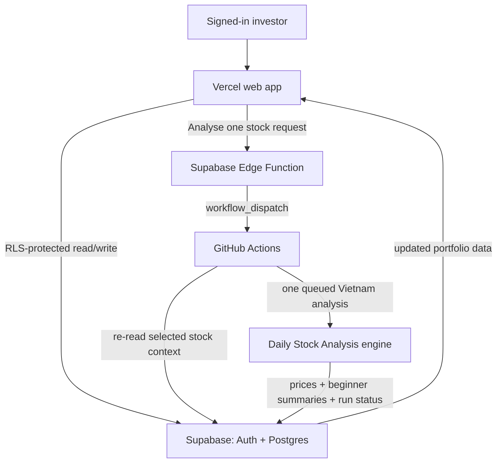

# Personal Vietnam Portfolio Tracker — Product Requirements and Delivery Plan

## 1. Product decision

Build a small, personal portfolio tracker as a separate web product. It will use Supabase as the durable source of truth for money, transactions, holdings, watchlists, prices, and saved analysis results. The existing Daily Stock Analysis Vietnam repository remains an analysis engine that GitHub Actions invokes; it is **not** migrated wholesale to Supabase.

The product initially serves one authenticated owner, tracks Vietnam securities only (`.VN`), uses VND for all money, and presents times in `Asia/Ho_Chi_Minh`.

This is a research and tracking tool, not investment advice or a trading platform. It must not place orders, connect to broker accounts, or present generated advice as guaranteed.

## 2. Problem and opportunity

Today, stock symbols are configured outside the user's day-to-day portfolio workflow and analysis reports are hard for a non-trader to interpret. The user needs one private place to:

- record where their money was invested;
- see current holdings, average cost, market value, and profit/loss in VND;
- maintain stocks they are watching but do not own;
- receive and read the latest plain-language analysis for those stocks; and
- choose when to run an analysis without opening GitHub.

The product should reduce manual copying between a brokerage statement, the analysis tool, Discord, and an LLM.

## 3. Target user and jobs to be done

### Primary user

One private Vietnam-focused retail investor who is comfortable recording transactions but is not expected to understand technical-analysis jargon.

### Jobs to be done

| Situation | User need | Successful outcome |
| --- | --- | --- |
| I buy or sell a stock | Record the transaction accurately | My holdings, cost basis, and cash reflect the trade. |
| I open the dashboard | Understand my portfolio at a glance | I see value, VND profit/loss, data freshness, and recent changes. |
| I am considering a stock | Add it without pretending I own it | It appears in my watchlist and receives analysis. |
| I want new information | Start or wait for an analysis run | The app clearly shows queued/running/completed/failed status. |
| I see a report | Understand what it means | I get a short beginner summary before optional technical details. |

## 4. Scope

### MVP: included

1. Private sign-in and ownership isolation.
2. One or more VND portfolio accounts.
3. A transaction ledger for cash deposits/withdrawals, buys, sells, dividends, and fees.
4. Derived current holdings using the average-cost method.
5. A watchlist independent of current holdings.
6. Latest stored price, market value, unrealized profit/loss, and price freshness for each holding.
7. A dashboard and holdings table with simple Vietnamese/English labels, depending on the final UI-language choice.
8. An individual **Analyse** action for every holding and every watchlist item. One GitHub Actions run analyses exactly one `.VN` symbol and writes its price snapshot and analysis result back.
9. A secure per-stock **Analyse** action in the web app; there is no MVP **Analyse all** action.
10. A beginner-first report summary, with technical detail hidden behind an optional section.
11. Explicit failed, stale, and missing-data states.

### Explicitly not in MVP

- Broker account connection, order placement, deposits/withdrawals through payment rails, or tax filing.
- Automatic transaction import; CSV import can be considered after the manual ledger is validated.
- Foreign stocks, foreign-currency accounting, or multi-market routing.
- Live tick-by-tick prices or browser calls to vnstock/data providers.
- Full migration of the existing SQLite database, alert engine, chat, Desktop app, or all report history.
- Multi-user sharing, family portfolios, or public/social features.

## 5. Product rules

- A stock symbol must use the `.VN` suffix.
- All monetary values are stored and displayed in VND; no invisible currency conversion is allowed.
- A transaction is the financial source of truth. Current positions are derived data and may be recalculated.
- Latest price is a cached snapshot, never an implied live quote. Every UI surface must show its `as_of` time and source.
- A sell cannot reduce a position below zero. Invalid transactions must be rejected rather than silently corrected.
- The holdings table and watchlist each show an **Analyse** action. The action is available for a holding with non-zero quantity and for every enabled watchlist item.
- One workflow run analyses exactly one canonical `.VN` symbol. A user chooses the stock to analyse; the workflow must not expand the request into a batch.
- The system has one global analysis queue. It waits for the configured cooldown after a result is persisted before any next stock analysis begins. The initial default is 60 seconds, configurable through a repository secret or variable.
- When an analysis is already queued or running, every other stock's button shows `Queued` rather than starting a parallel provider request. A same-stock duplicate is rejected or linked to the active run.
- Scheduled refresh is deferred from MVP. If added later, it must enqueue one single-stock run per eligible holding/watchlist item through the same global queue; it must not run a multi-stock batch.
- Reports must identify stale, incomplete, or failed data plainly.

### Stock and analysis states

The UI must show two separate state labels. They must not be combined into a vague generic status.

| State type | Values | Meaning |
| --- | --- | --- |
| Portfolio state | `Holding`, `Watching`, `Closed` | `Holding`: current quantity is greater than zero. `Watching`: no current holding and enabled in the watchlist. `Closed`: no current holding/watchlist entry but retained transaction or report history. Holding takes precedence when the same symbol is also watched. |
| Analysis state | `Never analysed`, `Ready`, `Queued`, `Running`, `Completed`, `Failed`, `Stale` | Lifecycle and freshness of the most recent per-stock analysis. `Stale` is shown when a completed result is older than the agreed freshness window. |
| Quote state | `Current`, `Stale`, `Missing` | Whether a latest stored price snapshot is inside the freshness window, out of date, or unavailable. |

## 6. Key user journeys

### Record an investment

1. User selects an account and chooses Buy.
2. User enters symbol, quantity, unit price, fees, and trade time.
3. The app validates VND values and the `.VN` symbol.
4. The transaction is saved.
5. The dashboard recalculates quantities, average cost, invested amount, and cash.

### View the portfolio

1. User opens the dashboard.
2. The app reads the user's derived holdings and latest stored quote snapshots from Supabase.
3. It displays invested amount, market value, unrealized VND profit/loss, percentage change, and quote freshness.
4. The user can refresh the displayed Supabase data; this does not invoke an external market-data provider.

### Analyse one holding or watched stock from the web app

1. Signed-in user presses **Analyse** on one holding or watchlist row.
2. The web app shows the portfolio state and the latest analysis state before confirmation.
3. A Supabase Edge Function confirms the caller's identity, derives the selected stock context from Supabase, and creates one `analysis_runs` row with `queued` status.
4. The Edge Function calls GitHub's `workflow_dispatch` API using a fine-grained token held only as a server-side secret.
5. GitHub Actions receives one symbol plus a run ID, re-reads the trusted context from Supabase, runs the existing analysis engine, and updates that run/result.
6. The web app observes the status update and shows the completed, failed, or stale result.

### Analysis context for a holding

For a holding, the analysis engine receives a low-sensitivity `portfolio_context` assembled server-side from the transaction ledger. It includes:

- `portfolio_state`: `holding`;
- `quantity`: the current number of shares held;
- `average_cost_vnd`: weighted-average cost per currently held share;
- `initial_entry_price_vnd`: the unit price of the first buy in the current holding cycle (the period from quantity zero to a later positive quantity);
- `position_opened_at`: when that current holding cycle began; and
- `total_cost_vnd`: current quantity multiplied by average cost, including the defined fee treatment.

For a watchlist item with no holding, the context contains `portfolio_state: watching` and no invented quantity or cost fields. This context makes the advice relevant to the user's exposure and entry price; it does **not** guarantee that a market-data or AI-generated conclusion is correct.

## 7. Target architecture



### Responsibilities

| Component | Responsibilities | Must not do |
| --- | --- | --- |
| Vercel web app | User interface, authenticated data entry, clear stock/analysis/quote states, individual analysis request | Hold privileged GitHub/Supabase secrets or call market-data providers. |
| Supabase | Authentication, Postgres persistence, RLS enforcement, realtime/status updates, secure Edge Function | Perform full stock analysis or act as a long-running scheduler. |
| GitHub Actions | One-stock manual analysis execution, global queue/cooldown enforcement, report generation, Discord notification, writes to Supabase | Expand one request into a batch, serve interactive web traffic, or expose secrets to logs. |
| Existing analysis engine | Fetch Vietnam data, generate reports and structured outputs | Own the user portfolio database or frontend auth. |

## 8. Conceptual data model

Every user-owned table includes `user_id uuid references auth.users`. Row Level Security is enabled and policies enforce `auth.uid() = user_id` for browser access.

| Table | Purpose | Core fields |
| --- | --- | --- |
| `portfolio_accounts` | Named VND accounts | `id`, `user_id`, `name`, `is_active`, `created_at` |
| `portfolio_transactions` | Immutable financial ledger | `id`, `user_id`, `account_id`, `type`, `symbol`, `quantity`, `unit_price_vnd`, `fee_vnd`, `amount_vnd`, `occurred_at`, `note` |
| `watchlist_items` | Symbols to analyse without a position | `id`, `user_id`, `symbol`, `is_enabled`, `created_at` |
| `stock_quotes_latest` | One latest quote per symbol | `symbol`, `price_vnd`, `change_percent`, `as_of`, `source`, `quality`, `updated_at` |
| `portfolio_position_snapshots` | Cached derived position values, optional in MVP | `user_id`, `account_id`, `symbol`, `quantity`, `average_cost_vnd`, `initial_entry_price_vnd`, `position_opened_at`, `market_value_vnd`, `unrealized_pnl_vnd`, `as_of` |
| `analysis_runs` | One-stock manual run lifecycle and global queue position | `id`, `user_id`, `symbol`, `trigger`, `status`, `queued_at`, `started_at`, `completed_at`, `error_summary`, `github_run_url` |
| `stock_analysis_results` | User-visible result and its context per symbol/run | `id`, `user_id`, `run_id`, `symbol`, `portfolio_state`, `action`, `confidence`, `summary_beginner`, `risk_summary`, `report_markdown`, `quote_as_of`, `created_at` |

`portfolio_transactions.type` is constrained to `cash_deposit`, `cash_withdrawal`, `buy`, `sell`, `dividend`, or `fee`. The first product version uses weighted-average cost and keeps the current holding cycle's first-buy price separately for analysis context. FIFO, realized P/L, and tax rules require a separate approved specification.

## 9. Security and privacy requirements

- Enable RLS on all exposed tables. Browser policies allow a user to read and change only rows with their own `user_id`.
- Use a Supabase publishable client key in the web app only. Never expose the Supabase service-role key or GitHub dispatch token to Vercel client code.
- Keep `SUPABASE_URL`, `SUPABASE_SERVICE_ROLE_KEY`, LLM/provider credentials, Discord webhooks, and any GitHub dispatch credential in server-side/GitHub Secrets only.
- The Edge Function must authenticate the caller, derive—not accept—the `user_id`, validate the selected stock belongs to the user's holding/watchlist, create one run only, and rate-limit manual dispatches.
- GitHub Actions must re-read the selected stock context, scope its database query/write to the dispatched user/run, and hold the global queue lock. It must not log portfolio values, tokens, or webhook URLs.
- Store only the report information needed for the dashboard; do not persist prompts, provider tokens, or sensitive raw configuration.

## 10. Reporting requirements

Each stock result starts with a short beginner summary:

- What the system observed.
- Plain-language action: consider buying, wait/watch, reduce, or avoid.
- Two or three reasons without unexplained indicators.
- Main risk and what would change the view.
- Data timestamp and quality warning.

Technical indicators, full Markdown evidence, and implementation diagnostics are optional detail, not the first content the user sees. The report must state that it is informational, not personal investment advice.

## 11. Delivery plan

### Phase 0 — Decisions and prototypes

Deliverables:

- Approved requirements in this document.
- Wireframes for dashboard, transaction form, holding detail, and run-status states.
- Supabase schema/RLS design reviewed before any production data is entered.
- A sample beginner summary and holding-context payload tested with five real `.VN` analysis reports.

Exit criteria: the owner approves the information hierarchy, cost-basis method, and definition of a completed analysis run.

### Phase 1 — Portfolio foundation

Deliverables:

- Supabase project, Auth, migrations, RLS policies, and a local development setup.
- Web sign-in, account setup, transaction ledger, watchlist, and calculated holdings.
- Dashboard with manual Supabase refresh and clear empty/stale/error states.

Exit criteria: a user can create a transaction ledger, reload the app, and see the same derived holdings while being unable to access another user's rows.

### Phase 2 — Analysis integration

Deliverables:

- A GitHub Actions workflow that receives and analyses exactly one user-selected eligible `.VN` symbol.
- A database-backed global queue with a guaranteed configurable cooldown before the next stock begins.
- Quote/result persistence, explicit portfolio/analysis/quote states, failure handling, and optional Discord notification.
- A private per-stock manual workflow dispatch path through a Supabase Edge Function.

Exit criteria: a holding and a watchlist item can each start a one-stock run; the global queue prevents concurrent provider calls; each completed result is written to the correct user without exposing privileged tokens to the browser.

### Phase 3 — Product quality

Deliverables:

- Beginner-first results, report history, and data-freshness labels.
- Run-status updates through polling or Supabase Realtime.
- Automated tests for ledger calculations, RLS policies, deduplication, cooldown behavior, and failure states.
- Operational logs, run links, and a short recovery guide.

Exit criteria: the owner can understand a result without a separate LLM, retry a failed run safely, and distinguish current from stale data.

### Phase 4 — Deferred enhancements

Consider only after MVP use validates the core workflow:

- Historical portfolio-value charts.
- CSV import from a chosen Vietnam broker format.
- Per-stock Discord routes.
- Alerts for holdings/watchlist conditions.
- FIFO/realized P/L and tax reporting.
- Multi-user/family sharing with explicit permissions.

## 12. Acceptance criteria for MVP

1. A signed-in user can create a VND account and record valid buy/sell transactions for `.VN` symbols.
2. Holdings, average cost, market value, and unrealized VND P/L are derived correctly from the ledger.
3. A user can add/remove enabled watchlist symbols independently of holdings.
4. The dashboard shows each quote's source and timestamp, and visibly marks missing or stale prices.
5. Every holding and enabled watchlist row exposes an individual Analyse action and clearly shows portfolio, analysis, and quote states.
6. One manual workflow dispatch receives one eligible symbol only and re-reads that user's trusted context from Supabase.
7. The global queue enforces the configured cooldown before the next stock begins analysis and prevents simultaneous provider calls.
8. A holding analysis includes current quantity, weighted-average cost, current-cycle first-buy price, and current-cycle opened time; a watchlist analysis includes no fabricated portfolio values.
9. Results are written only to the dispatched user's records and include a beginner summary plus a data-quality state.
10. Browser users cannot read or write another user's financial data.
11. A provider, Discord, or one-symbol failure does not erase prior data or prevent a later queued single-stock run from completing.

## 13. Risks and mitigations

| Risk | Mitigation |
| --- | --- |
| vnstock/provider rate limits | One-stock workflow dispatches, a database-backed global queue, configurable cooldown, provider retry/fallback behavior, and visible queued/failed status. |
| Stale prices mislead the user | Store `as_of`, source, and quality; never label cached data as live. |
| Financial data exposure | Supabase Auth, RLS ownership policies, no privileged keys in browser code, and secret redaction. |
| GitHub Action duration/cost | Run one chosen stock per workflow, reject duplicate active runs, serialize globally, and show queued status/run limits. |
| Incorrect portfolio calculations | Treat the transaction ledger as canonical; add calculation tests before charts/imports. |
| Analysis language is too technical | Validate beginner summaries against real reports before broad feature work. |
| Existing app coupling slows delivery | Reuse the engine as a single-stock worker only; do not migrate unrelated SQLite/API/Desktop concerns into the MVP. |

## 14. Decisions required before implementation

1. Is this strictly one owner, or should the first release support multiple users from day one?
2. Should the initial UI be Vietnamese, English, or bilingual? Financial terms and beginner summaries must follow this decision.
3. Is weighted-average cost acceptable for MVP, with FIFO and realized P/L deferred?
4. What quote freshness is useful: end-of-day only or manual-analysis updates? Automated scheduled refresh is deferred from MVP.
5. What cooldown should the global queue use after each completed stock: 60 seconds by default, or a different value?
6. Which five `.VN` symbols should be used as MVP test data, and should they receive Discord notifications?
7. Is a separate repository preferred for the new web app, while this repository stays the analysis engine?

## 15. Rollback approach

The new product must not replace the current local SQLite workflow. Rollback consists of disabling the new GitHub workflow/Edge Function and retaining Supabase data as a read-only backup. Existing local analysis, reports, and notifications continue independently.

## 16. New-project technical blueprint

### Chosen stack

The new product is a standalone repository named `personal-portfolio-tracker`. It is a mobile-first React PWA, not a rewrite of the existing FastAPI/Web/Desktop application.

| Layer | Choice | Reason |
| --- | --- | --- |
| Web app | React + TypeScript in strict mode + Vite | Small static Vercel deployment; Supabase documents this React/Vite path. |
| Routing | React Router | Explicit mobile routes and protected pages without server-side rendering. |
| Server-state access | TanStack Query + `@supabase/supabase-js` | Caching, loading/error states, explicit invalidation after transaction changes, and controlled polling/realtime updates. |
| Forms and validation | React Hook Form + Zod | Mobile-friendly forms with the same client validation rules used by the UI. Database constraints remain authoritative. |
| Styling | Tailwind CSS + a small local component layer | Fast mobile-first layout without importing the existing application's UI system. |
| PWA | `vite-plugin-pwa` backed by Workbox | Generates the manifest/service worker for Vite and supports an installable app shell. |
| Tests | Vitest + Testing Library; Playwright for critical phone-sized flows | Fast logic/component tests plus real-browser PWA/auth smoke coverage. |
| Database and auth | Supabase Postgres + Auth + RLS | Durable relational transactions and user isolation. |
| Trusted web action | Supabase Edge Function | Holds the GitHub dispatch credential and validates the signed-in caller. |
| Hosting | Vercel | Hosts the static PWA only. |
| Analysis worker | This existing repository in GitHub Actions | Retains Vietnam providers, report generation, rate control, and Discord integration. |

Use the current stable releases at initialization, pin package versions through `package-lock.json`, and review official release notes before dependency upgrades. The browser uses only `VITE_SUPABASE_URL` and `VITE_SUPABASE_PUBLISHABLE_KEY`; those are public client configuration values, not privileged secrets. Supabase's current React quickstart uses this Vite environment-variable pattern. [Supabase React quickstart](https://supabase.com/docs/guides/auth/quickstarts/react)

### Repository structure

```text
personal-portfolio-tracker/
├─ src/
│  ├─ app/
│  │  ├─ router.tsx
│  │  ├─ providers.tsx
│  │  └─ query-client.ts
│  ├─ components/
│  │  ├─ layout/                 # App shell, mobile bottom navigation, headers
│  │  ├─ portfolio/              # Holding cards, summary cards, transaction form
│  │  ├─ analysis/               # State badge, Analyse button, beginner summary
│  │  └─ ui/                     # Small reusable accessible primitives
│  ├─ features/
│  │  ├─ auth/
│  │  ├─ dashboard/
│  │  ├─ portfolio/
│  │  ├─ watchlist/
│  │  ├─ analysis-runs/
│  │  └─ settings/
│  ├─ lib/
│  │  ├─ supabase.ts
│  │  ├─ money.ts                # VND formatting and integer/decimal helpers
│  │  ├─ symbols.ts              # `.VN` validation and canonicalisation
│  │  └─ dates.ts                # Asia/Ho_Chi_Minh display helpers
│  ├─ hooks/
│  ├─ types/
│  ├─ styles/
│  ├─ test/
│  ├─ main.tsx
│  └─ vite-env.d.ts
├─ public/
│  ├─ icons/                     # Maskable and standard PWA icons
│  └─ offline.html
├─ supabase/
│  ├─ migrations/                # Generated through `supabase migration new`
│  ├─ functions/
│  │  └─ request-stock-analysis/ # Authenticated GitHub workflow dispatch
│  ├─ seed.sql                   # Non-financial local development fixtures only
│  └─ config.toml
├─ e2e/
│  ├─ auth.spec.ts
│  ├─ transaction-ledger.spec.ts
│  └─ mobile-analysis-request.spec.ts
├─ docs/
│  ├─ architecture.md
│  ├─ setup.md
│  └─ runbook.md
├─ .env.example
├─ vite.config.ts
├─ package.json
└─ README.md
```

Feature code owns its data queries, mutations, and feature-specific components. The `components/ui` layer contains no Supabase calls or financial rules. Money, symbols, and position calculations remain in typed `lib`/feature modules with tests, never embedded inside page JSX.

### Initial routes

| Route | Purpose | Phone-first primary action |
| --- | --- | --- |
| `/login` | Email/magic-link authentication | Sign in |
| `/` | Dashboard: total invested, value, P/L, freshness, recent runs | Open a holding or add a transaction |
| `/portfolio` | Holding cards and account filter | Analyse / Add transaction |
| `/portfolio/:symbol` | One holding's transactions, cost context, quote, latest report | Analyse this stock |
| `/watchlist` | Watched-stock cards | Analyse / Add watch item |
| `/watchlist/:symbol` | One watched stock's price and report history | Analyse this stock |
| `/activity` | Run history and errors | Open run/result |
| `/settings` | Profile, app preferences, install help, sign out | Install app / Sign out |

## 17. Mobile-first and PWA requirements

### Mobile interaction rules

- Design first for 320–430 CSS-pixel widths, then enhance for tablets/desktops. No feature may require a hover interaction.
- Use a bottom navigation bar on phones: `Home`, `Portfolio`, `Watchlist`, `Activity`, `Settings`. Keep the primary **Analyse** action inside each stock card/detail view rather than a global floating batch action.
- Render holdings and watchlist items as vertically stacked cards on phones. A desktop table is an enhancement, not the only implementation.
- All actionable controls have a minimum 44 × 44 CSS-pixel target, visible focus state, accessible label, and disabled explanation where relevant.
- Keep the current price, P/L, state badge, data timestamp, and Analyse action visible in the first card viewport. Full report content opens below or in a dedicated detail view.
- Use Vietnamese VND formatting consistently, avoid horizontal scrolling for money values, and support long Vietnamese company names/symbols without clipping critical state.
- Confirm destructive actions such as deleting a transaction or watchlist item; do not ask for confirmation before ordinary refresh/navigation.

### PWA contract

- Provide one web manifest with name, short name, `standalone` display, theme/background colours, and 192px/512px standard plus maskable icons. A manifest is required for reliable cross-browser installability. [Web app manifest guidance](https://web.dev/learn/pwa/web-app-manifest)
- Register one service worker through `vite-plugin-pwa` and show a non-blocking **Update available** prompt when a new version is ready.
- Precache only versioned static application assets and the offline page. Do **not** cache Supabase API responses, reports, quote data, or authenticated portfolio records in the service worker for MVP: stale/private financial data must not appear as current.
- When offline, show a clear offline screen with the last known connection state. Mutation, sign-in, analysis, and price-refresh actions are disabled with an explanation; do not queue financial transactions silently.
- The PWA is installable from the browser. It is not an APK/native brokerage application and does not require an app-store package for MVP. Installed PWAs use a manifest and service worker to provide the standalone app experience. [PWA installation guidance](https://web.dev/learn/pwa/installation)
- Push notifications, background sync, and offline transaction drafts are deferred. They add privacy, delivery, and conflict-resolution requirements that are not needed to validate the first product.

## 18. Detailed integration contracts

### Browser to Edge Function

The browser calls one authenticated endpoint:

```text
POST /functions/v1/request-stock-analysis
{ "symbol": "VNM.VN" }
```

The client sends only the symbol. It never submits quantity, cost, `user_id`, a run status, or a GitHub token. The Edge Function derives the signed-in user and authoritative stock context from Supabase, validates eligibility, creates the run record, and dispatches the worker.

Possible result states are:

```text
accepted     A new queue record was created.
queued       Another analysis owns the global execution slot.
duplicate    This symbol already has an active run for the user.
ineligible   The symbol is neither a non-zero holding nor an enabled watchlist item.
rate_limited The user requested analysis too frequently.
```

### Edge Function to GitHub Actions

The Edge Function dispatches the existing analysis repository workflow with only:

```text
run_id
```

The workflow uses `run_id` and a server-side Supabase credential to re-read the symbol, user scope, and context. It must treat all dispatch inputs as untrusted. The detailed portfolio context never travels in the browser request or GitHub dispatch payload.

### GitHub Actions to Supabase

For one claimed run, the worker:

1. obtains the global queue lock or records/retains `queued` status;
2. re-reads the eligible symbol and holding/watchlist context;
3. writes `running` with timestamps and GitHub run URL;
4. fetches quote data and runs one existing `.VN` analysis;
5. writes the latest quote and one analysis result for the correct `user_id`/`run_id`;
6. writes `completed` or `failed` with a safe, user-readable error summary; and
7. records the next allowed execution time before releasing the lock.

The global queue is a database contract, not only a GitHub `concurrency` setting. GitHub concurrency alone does not provide a durable, inspectable first-in-first-out queue for financial-analysis requests.

## 19. Initialization and build sequence

### Step 1 — Create the new repository and web shell

- Initialize the React TypeScript Vite app.
- Add the chosen dependencies, linting, unit-test setup, and lockfile.
- Configure Vercel as a static build deployment.
- Add `.env.example` with only public browser variables:

```dotenv
VITE_SUPABASE_URL=
VITE_SUPABASE_PUBLISHABLE_KEY=
```

- Add the PWA manifest, icons, offline page, and basic service-worker configuration before building feature screens.

### Step 2 — Create and secure Supabase

- Create a Supabase project and initialize the CLI project locally.
- Create migrations for profiles/accounts/transactions/watchlist/quotes/runs/results/queue lock.
- Enable RLS and write ownership policies before adding browser queries.
- Add the Edge Function and its server-side secrets. Never add a service-role key to the Vite environment.
- Test one user cannot select, insert, update, or delete another user's rows.

### Step 3 — Build the mobile portfolio MVP

- Build sign-in, app shell, dashboard, transaction ledger, holdings, and watchlist.
- Implement server-authoritative symbol and transaction validation.
- Add unit tests for weighted-average cost, position cycles, first-entry price, VND display, state classification, and stale-data decisions.

### Step 4 — Connect one-stock analysis

- Add the per-stock Analyse button and run-state UI.
- Implement the Edge Function dispatch contract and the analysis repository's one-stock workflow contract.
- Implement the database-backed queue/cooldown, quote/result writes, and failures.
- Validate holding and watchlist flows separately with a controlled `.VN` test symbol.

### Step 5 — Make it operable

- Add PWA installation/update/offline smoke tests on a phone-sized browser viewport.
- Add run history, safe error messages, data timestamps, and a recovery/runbook page.
- Configure Vercel, Supabase, and GitHub Secrets separately; perform a secret-exposure review.

## 20. Definition of ready to start implementation

Implementation may begin when these decisions are confirmed:

1. `personal-portfolio-tracker` is the approved new repository name/location.
2. The MVP is single-owner, Vietnam-only, VND-only, and phone-first.
3. Weighted-average cost plus current-cycle initial-entry price is accepted as the initial accounting rule.
4. Manual per-stock analysis with a 60-second global cooldown is accepted; scheduled refresh remains out of MVP.
5. Initial UI language is chosen.
6. Supabase, Vercel, and GitHub repositories/accounts are available to the owner.
7. The existing analysis repository will expose/accept the approved `run_id` one-stock worker contract in a later, separate change.
